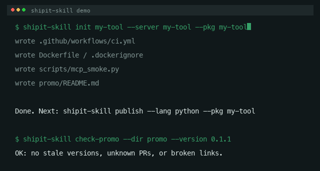

# ⚙️ shipit-skill

[](https://github.com/skyzhao1223/shipit-skill/actions/workflows/ci.yml)
[](https://pypi.org/project/shipit-skill/)
[](https://pypi.org/project/shipit-skill/)
[](LICENSE)

**Take an existing developer tool from "it works" to "published + listed + marketable" — one pass.**

`shipit-skill` is an Agent Skill that runs the full launch pipeline for AI/developer tools
(MCP servers, CLIs, libraries): engineering baseline → publish → directory listings →
promo material. It was distilled from shipping [wheel-hub](https://github.com/skyzhao1223/wheel-hub),
[zspace-cli](https://github.com/skyzhao1223/zspace-cli) and
[media-manager-skill](https://github.com/skyzhao1223/media-manager-skill) — every gotcha
below is one that actually bit during those releases.

## Install

Two ways to use it — as a CLI tool or as an Agent Skill:

**A. CLI (via pip)** — for running the pipeline commands yourself:

```bash
pip install shipit-skill
shipit-skill init ./my-tool --server my-tool --pkg my-tool   # scaffold CI/Dockerfile/promo
shipit-skill check-promo --dir promo --version 0.1.1 --prs 13600=open
```

**B. Agent Skill** — copy this folder into your project (or your agent's skills dir):

```bash
cp -r shipit-skill/ ~/your-project/.opencode/skills/shipit-skill   # opencode
# cp -r shipit-skill/ ~/your-project/skills/shipit-skill            # Claude Code, Cursor, etc.
```

## What it does

| Phase | Exit criterion | CLI |
|-------|----------------|-----|
| **0. Recon** | gap report (CI? Docker? Release? listed? promo?) | — |
| **1. Baseline** | CI green, metadata right, Dockerfile present | `shipit-skill ci`, `shipit-skill init` |
| **2. Publish** | on registry + GitHub Release + clean-env verified | `shipit-skill publish` |
| **3. Listings** | Glama live + awesome PR open | `shipit-skill check-glama`, `shipit-skill awesome-pr` |
| **4. Promo** | promo docs match reality | `shipit-skill check-promo` |

See [`SKILL.md`](SKILL.md) for the full agent instructions and the automation
boundary (what the agent runs vs. what needs a human/credential).

## Example

[`examples/mcp-server-launch.md`](examples/mcp-server-launch.md) walks all four
phases against a toy `hello-mcp` server — reproduce it locally to learn the
pipeline before applying it to a real project.



## Automate releases (GitHub Action)

`shipit-skill release --execute` runs a **doctor gate**, bumps, builds, publishes
to PyPI, then tags + opens a GitHub Release (notes from CHANGELOG) — all from a
token in `PYPI_TOKEN` env. Re-running is safe (existing tags/releases are
skipped), and a failed publish rolls back the commit instead of leaving a
dangling release. Preview what it will do without touching anything:

```bash
shipit-skill release --lang python --pkg your-tool --how minor --dry-run-notes
```

Hook it up as a manual GitHub Actions job:

```yaml
# .github/workflows/release.yml
name: Release
on:
  workflow_dispatch:
    inputs:
      how: {type: choice, options: [patch, minor, major], default: patch}
jobs:
  release:
    runs-on: ubuntu-latest
    permissions: {contents: write}
    steps:
      - uses: actions/checkout@v4
        with: {fetch-depth: 0}
      - uses: actions/setup-python@v5
        with: {python-version: "3.12"}
      - run: pip install -e ".[dev]" build twine
      - run: shipit-skill doctor   # fail fast on missing prereqs
        env: {PYPI_TOKEN: ${{ secrets.PYPI_TOKEN }}}
      - run: shipit-skill release --lang python --pkg your-tool \
             --how ${{ inputs.how }} --repo owner/your-tool --execute
        env:
          PYPI_TOKEN: ${{ secrets.PYPI_TOKEN }}
```

Other one-shot commands with `--execute`: `publish` (real PyPI/NPM upload +
fresh-install verify, auto-retry with diagnostic hints), `bump --commit`
(bump + git commit), and `awesome-pr --execute` (opens the PR via `gh`).
`changelog --version X.Y.Z` generates a CHANGELOG entry from your git log.
`--lang` is auto-detected from `pyproject.toml` / `package.json`.

## Development

```bash
pip install -e ".[dev]"
pytest -q          # 179 tests, coverage ≥ 93%, parallel (-n auto)
ruff check .       # lint
pyright            # type check (strict)
```
```

## The scars (why this exists)

- `mcp>=1.0` + a new SDK → fresh installs crash. Set dependency floors.
- Python 3.9 can't install `mcp>=2.0` — split the CI matrix.
- YAML block scalar + inline heredoc = broken workflow. Use a script file.
- Glama introspection needs stdin held open (`sleep 1`) in smoke tests.
- PyPI tokens start `pypi-`; UUID-style strings are wrong and 403.
- npm typosquatting blocks similar names — scoped names dodge it.
- Glama builds take minutes to hours — poll, don't panic.

## License

MIT
